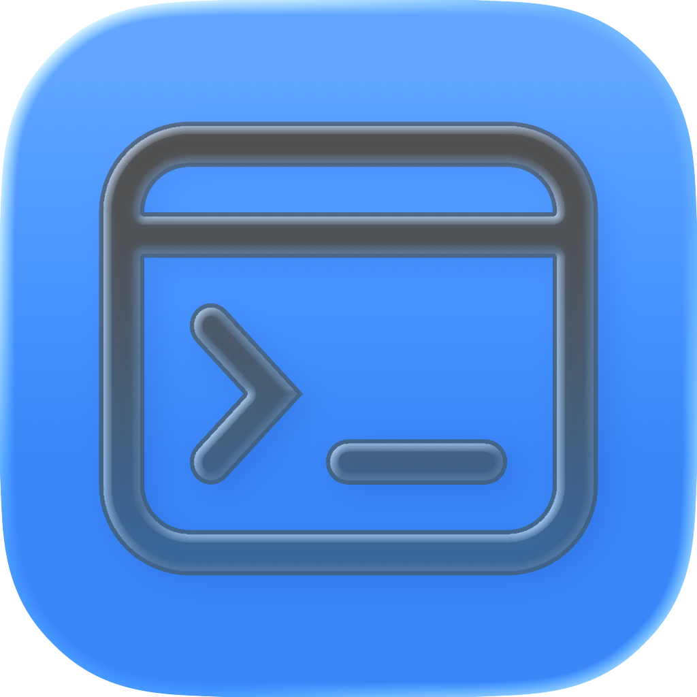
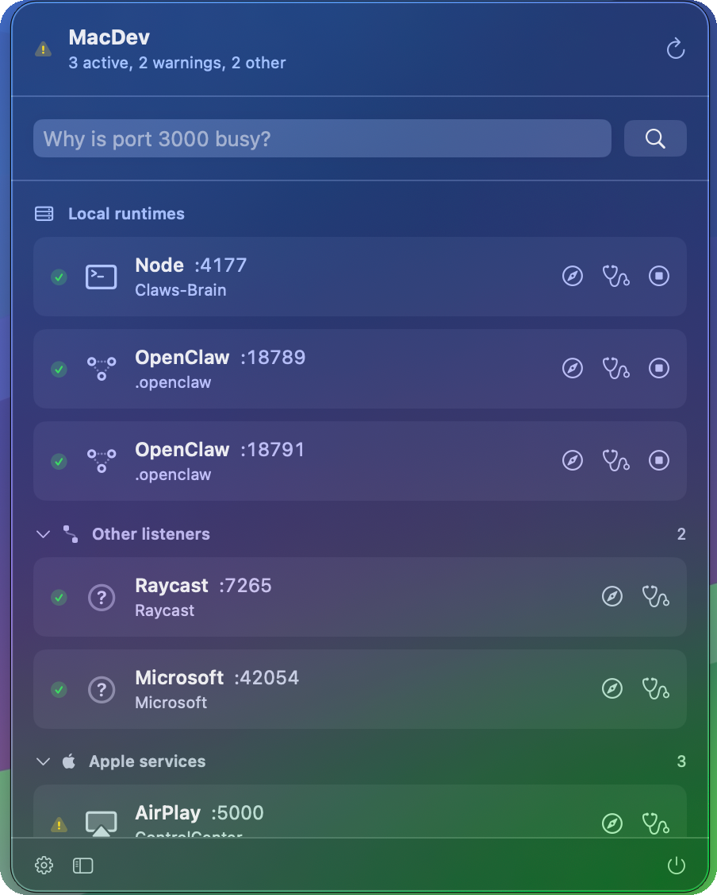

<div align="center">

# MacDev

Native macOS menu bar control center for local developer runtimes.

[](https://github.com/jx-grxf/MacDev/actions/workflows/ci.yml)
[](https://github.com/jx-grxf/MacDev/releases/latest)




[Download latest preview](https://github.com/jx-grxf/MacDev/releases/latest) | [Release runbook](docs/release.md) | [Security](SECURITY.md)

</div>

> [!TIP]
> MacDev is built for the exact moment when: "What the hell is running on port 3000?" "What dev server is blocking port 5050?" "What localhost instances are running?"

## Showcase

<p align="center">
  
</p>

MacDev stays in the macOS menu bar and gives local development servers a visible control surface: scan active ports, identify the owning process, open the right localhost URL, diagnose collisions, and stop exact PIDs without broad destructive commands.

It is intentionally local-first. There is no account, cloud sync, analytics pipeline, or backend service.

## Contents

- [Highlights](#highlights)
- [Download](#download)
- [Install](#install)
- [First Launch](#first-launch)
- [What Works Today](#what-works-today)
- [Safety and Trust](#safety-and-trust)
- [Why This Exists](#why-this-exists)
- [Current Workflow](#current-workflow)
- [Tech Stack](#tech-stack)
- [Requirements](#requirements)
- [Quick Start](#quick-start)
- [Usage](#usage)
- [Development](#development)
- [Release Process](#release-process)
- [Roadmap](#roadmap)
- [Contributing](#contributing)
- [License](#license)

## Highlights

| Feature | Description |
| --- | --- |
| Menu bar first | Keeps local runtimes visible without becoming another full-time desktop window. |
| Port discovery | Maps listening TCP ports to process IDs, commands, owners, working directories, and likely runtimes. |
| Collision diagnosis | Explains common causes like busy ports, Vite fallback ports, Next.js defaults, and AirPlay conflicts. |
| Precise process control | Opens URLs, sends SIGTERM to exact PIDs, and gates force kill behind an explicit confirmation. |
| Workspace profiles | Reads `package.json` scripts and detects npm, pnpm, yarn, or bun from lockfiles. |
| Native macOS shell | Uses SwiftUI, `MenuBarExtra`, Settings, and a dedicated runtime browser instead of a web wrapper. |

## Download

The current preview DMG is attached to the latest GitHub Release:

[Download MacDev from GitHub Releases](https://github.com/jx-grxf/MacDev/releases/latest)

> [!IMPORTANT]
> Preview builds are ad-hoc signed for bundle integrity but are not Developer ID notarized yet. macOS may show a Gatekeeper warning until notarized releases ship.

## Install

1. Download the latest `MacDev-<version>.dmg` from GitHub Releases.
2. Open the DMG and drag `MacDev.app` into Applications.
3. Launch MacDev from Applications. It appears in the menu bar, not the Dock.
4. If macOS blocks the preview build, right-click `MacDev.app`, choose Open, then confirm Open again.

MacDev currently ships as a preview build. Developer ID notarization, a Homebrew Cask, and fully automatic public distribution are on the roadmap.

## First Launch

After launch, click the MacDev menu bar icon. The panel shows active local runtimes, warnings, and a port diagnosis field. Use Settings to add workspace folders, enable notifications, choose an update channel, and control which system listeners appear.

If the app seems invisible, check the right side of the macOS menu bar. MacDev intentionally stays out of the Dock so it behaves like a lightweight developer utility.

## What Works Today

- Detect listening TCP ports using macOS-native command line tools.
- Map ports to process IDs, commands, users, and working directories.
- Classify common local runtimes such as Vite, Next.js, Astro, Nuxt, Bun, pnpm, yarn, npm, Docker, Homebrew, and AirPlay-like system ports.
- Diagnose a specific busy port from the menu bar.
- Open localhost URLs and stop validated developer-runtime PIDs.
- Read `package.json` scripts from saved workspace folders.
- Show launchd user agents read-only.
- Send local notifications for scan failures, expected missing ports, warning transitions, and managed script failures.
- Check for Sparkle updates from GitHub Releases when release signing keys are configured.

## Safety and Trust

MacDev is local-only. It does not collect analytics, upload process data, or use a backend service.

Process control is deliberately narrow:

- No `killall node`.
- No broad destructive git or workspace actions.
- Normal stop revalidates the listener, command, owner, and working directory before sending SIGTERM.
- Force kill is an explicit destructive action with confirmation.
- System-looking services such as AirPlay, Docker, and Homebrew are explained before action is suggested.
- Workspace scripts only run after user action. They are project-owned `package.json` commands, so review scripts before launching unfamiliar folders.
- Script environment variables are filtered so common shell secrets are not passed through by default.

## Why This Exists

Local development on macOS gets messy fast: `npm run dev` exits, a server keeps running, port 3000 is busy, Vite silently moves to another port, or AirPlay owns port 5000. MacDev makes those local runtimes visible and actionable from one native macOS surface.

## Current Workflow

1. Open MacDev from the menu bar.
2. Scan active listening ports and detected runtimes.
3. Open a localhost URL, diagnose a busy port, or stop a specific process.
4. Add workspace folders and run package scripts from saved profiles.

## Tech Stack

| Layer | Choice |
| --- | --- |
| App | SwiftUI, macOS 14+ |
| UI shell | `MenuBarExtra`, `Settings`, optional runtime window |
| State | Observation (`@Observable`) |
| Runtime discovery | `lsof`, `ps`, `launchctl` |
| Project model | Swift Package Manager, Xcode-openable |
| CI | GitHub Actions on macOS |
| Tests | Swift Testing via XCTest |

## Requirements

For users:

- macOS 14 or newer

For development:

- macOS 14 or newer
- Xcode 15+ or Apple Swift toolchain
- Command line tools with `swift`, `lsof`, `ps`, and `launchctl`
- `create-dmg`, `hdiutil`, `codesign`, and Sparkle signing keys for local release packaging

## Build from Source

```bash
./script/build_and_run.sh
```

The script builds MacDev, stages `dist/MacDev.app`, and launches the app bundle.

To create a local preview DMG:

```bash
MACDEV_VERSION=0.2.1 ./script/package_dmg.sh
```

## Usage

- Click the menu bar icon to see current localhost runtimes.
- Use the port field to diagnose a busy port.
- Add project folders in Settings to discover scripts.
- Start scripts from workspace profiles.
- Use graceful stop first; force kill is guarded by confirmation.

## Development

```bash
swift build
swift test
./script/build_and_run.sh --verify
```

The scanner, parser, classifier, process-control, and profile logic live in `MacDevCore` so they can be tested without launching the app.

## Release Process

Tagged releases are built by GitHub Actions. The release workflow builds a release-mode app bundle, creates a DMG, creates Sparkle ZIP/appcast assets, verifies the app signature and disk image, uploads artifacts, and attaches release assets to the GitHub Release.

Release details live in [docs/release.md](docs/release.md). Public release notes are kept in [RELEASE_NOTES.md](RELEASE_NOTES.md).

## Roadmap

- Short demo clip and notarized installer walkthrough
- Developer ID signed and notarized preview releases
- Homebrew Cask
- Public Sparkle update feed with signed stable and beta channels
- Collision and crash notification history
- Advanced workspace orchestration
- Exportable team profiles

## Contributing

Issues and focused pull requests are welcome. Start with [CONTRIBUTING.md](CONTRIBUTING.md), keep changes scoped, and run `swift test` before opening a PR.

Security reports should follow [SECURITY.md](SECURITY.md).

## License

MIT. See [LICENSE](LICENSE).
